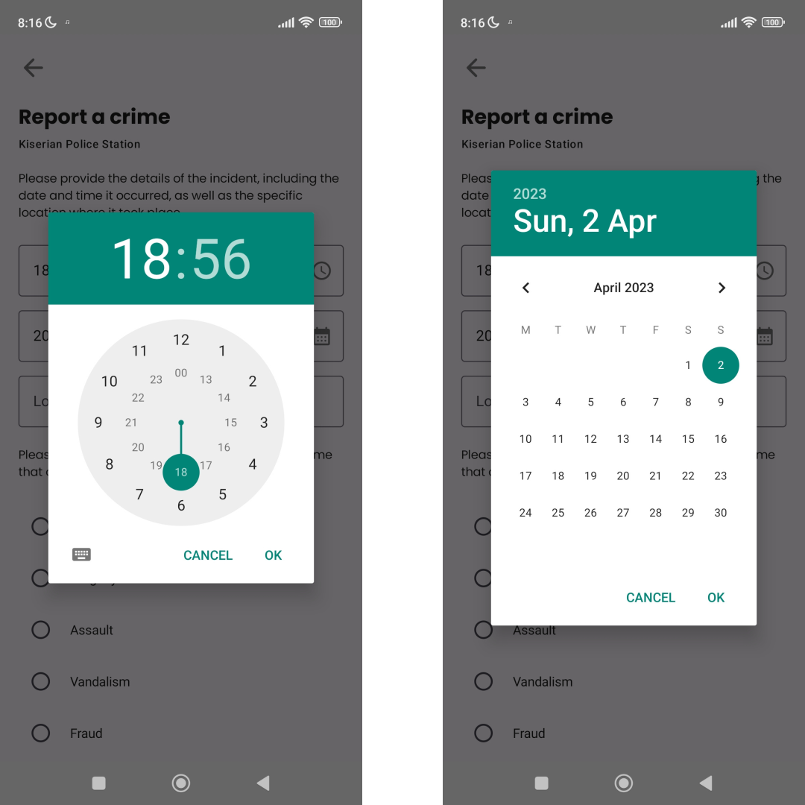
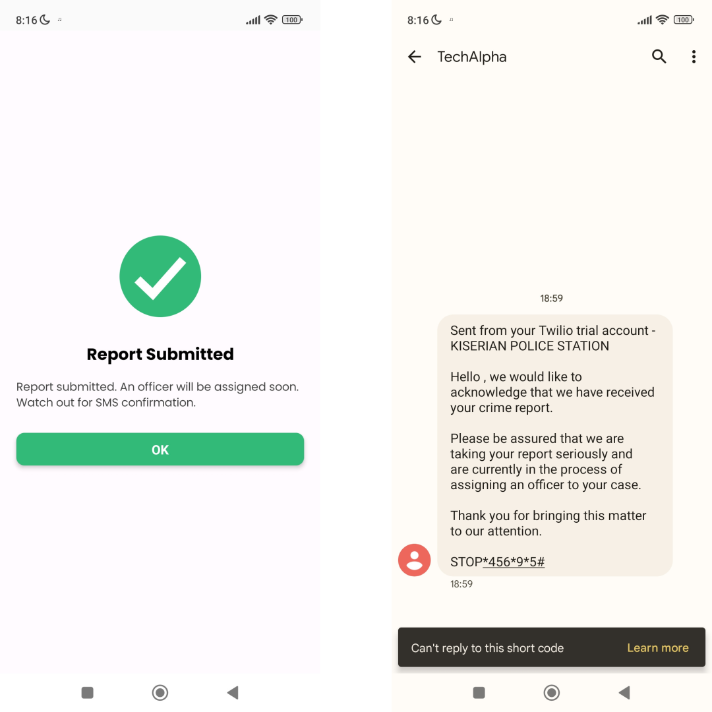
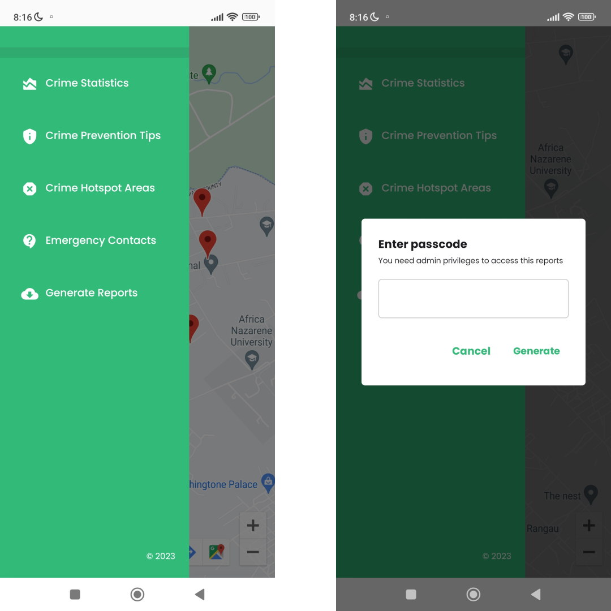
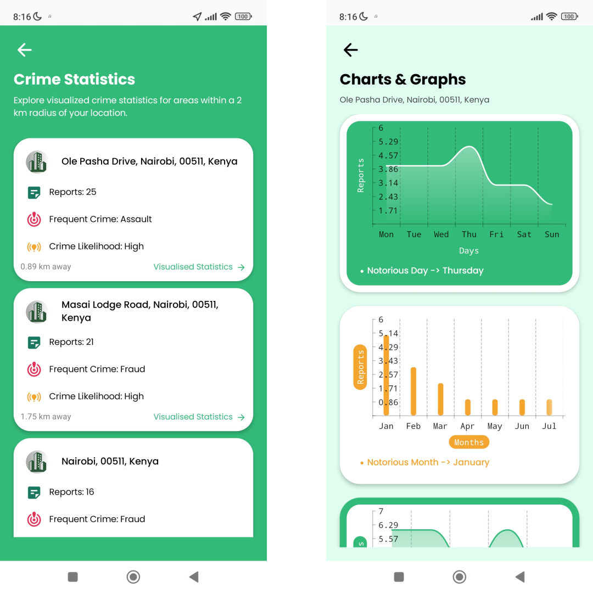
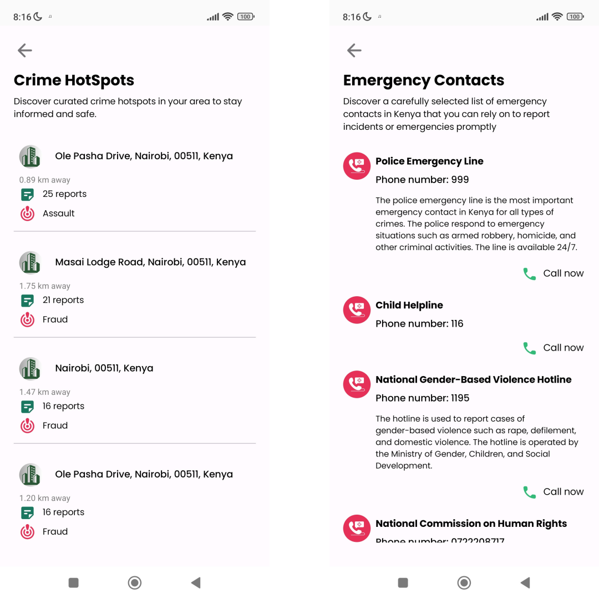

# SAFECITY APP 📱

SafeCity App is a mobile application built with Kotlin and Jetpack Compose that allows users to report crimes and other incidents in their area to the local authorities. The app retrieves user location and shows nearest police station and crime hotspots based on the current location. The app also provides visualized statistics and crime insights to the user. It also provides crime prevention tips and a list of emergency contacts that the user can contact in case of an emergency. The reports are stored in a Firebase database and can be accessed by the local authorities. Once a report is made, the user is notified via SMS. A PDF of the reported incidents can also be accessed by the admin.

## 💡 Note

A real-world application would require a lot more features and security. This app is not meant to be used in production. Furthermore, the data used in the analysis is fake and is only meant to demonstrate the analysis techniques. The data is not representative of the actual crime rates in Nairobi.

## 🔑 Permissions Required
The app requires the following permissions to run:

    ACCESS_COARSE_LOCATION
    INTERNET
    ACCESS_FINE_LOCATION
    CALL_PHONE

## 📱 Screenshots
The screenshots below show the app in action.









## 🛠 Tech/framework used
**Built with**
- [Kotlin](https://kotlinlang.org/)
- [JetPack Compose](https://developer.android.com/jetpack/compose)
- [Firestore](https://firebase.google.com/docs/firestore)
- [Google Maps API](https://developers.google.com/maps/documentation)
- [Twilio Messaging API](https://www.twilio.com/docs/sms/api)

## 🛠 Installation & Set Up
MAPS API KEY is required to run the app. The API key can be obtained from the Google Cloud Platform. The API key should be added to the `AndroidManifest.xml` file.

TWILIO ACCOUNT SID, AUTH TOKEN and TWILIO PHONE NUMBER are required to run the app. The account SID and auth token can be obtained from the Twilio Console. The phone number can be obtained from the Twilio Console. The account SID, auth token and phone number should be added to your `local.properties` file.

Example of `local.properties` file:

```
## This file is automatically generated by Android Studio.
# Do not modify this file -- YOUR CHANGES WILL BE ERASED!
#
# This file should *NOT* be checked into Version Control Systems,
# as it contains information specific to your local configuration.
#
# Location of the SDK. This is only used by Gradle.
# For customization when using a Version Control System, please read the
# header note.
sdk.dir=/home/lynne/Android/Sdk
MAPS_API_KEY=ABCDEF
ACCOUNT_SID=ABCDEF1234567890
AUTH_TOKEN=1234567890ABCDEF
TWILIO_NUMBER=+1234567890
```

## 📝 License
This project is licensed under Apache License 2.0 - see the LICENSE file for details.

## 📊 Crime Data Analysis

The [safecity-analysis](https://github.com/lynnemunini/safecity-analysis) repository is responsible for analyzing crime reports, with the aim of identifying common patterns and providing insights to help identify high-risk areas and predict the likelihood of crimes happening in specific locations. The analysis is done using a **fake** dataset of crime reports from the city of Nairobi. The data from the analysis is available in the `data.json` file and is accessed using `Retrofit`.

The analysis includes various techniques, such as data visualization and statistical analysis. The aim is to provide actionable insights that can help law enforcement agencies and other organizations to prevent crime and improve public safety.

To view the crime analysis, please visit the [safecity-analysis](https://github.com/lynnemunini/safecity-analysis) repository.
