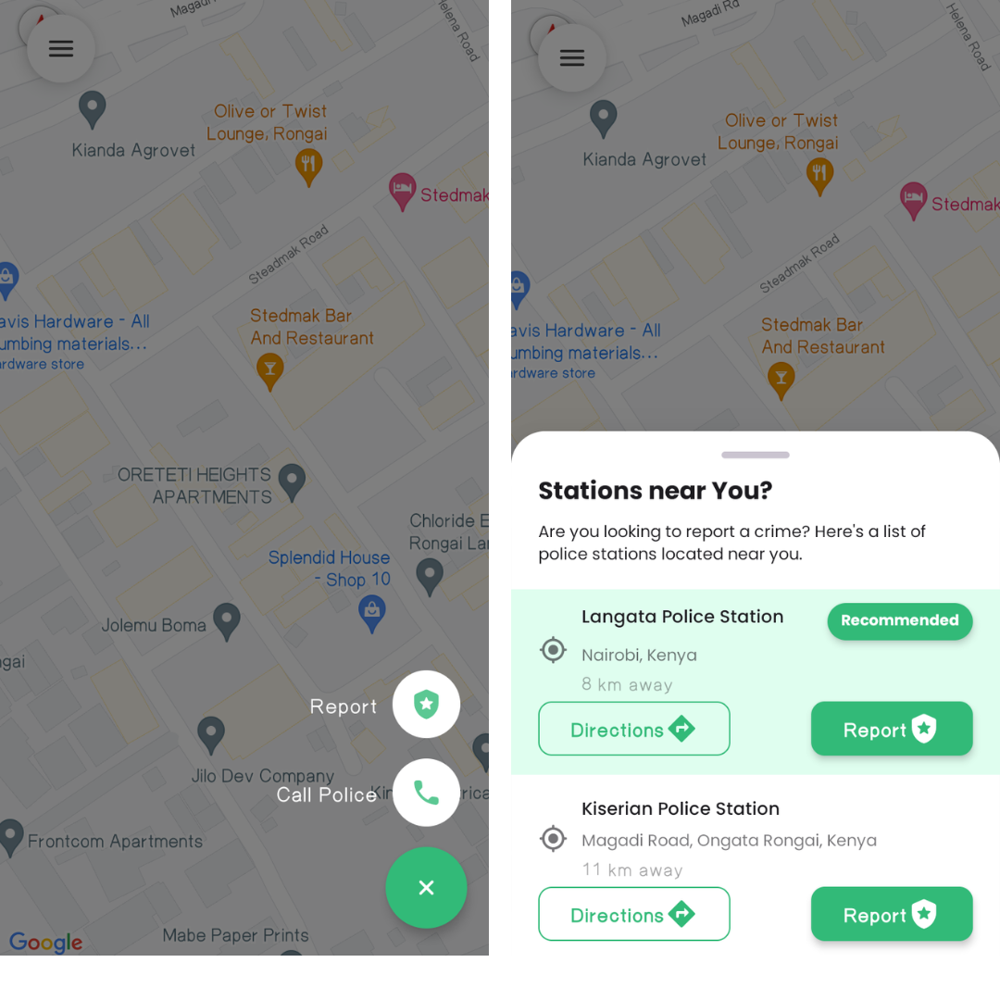
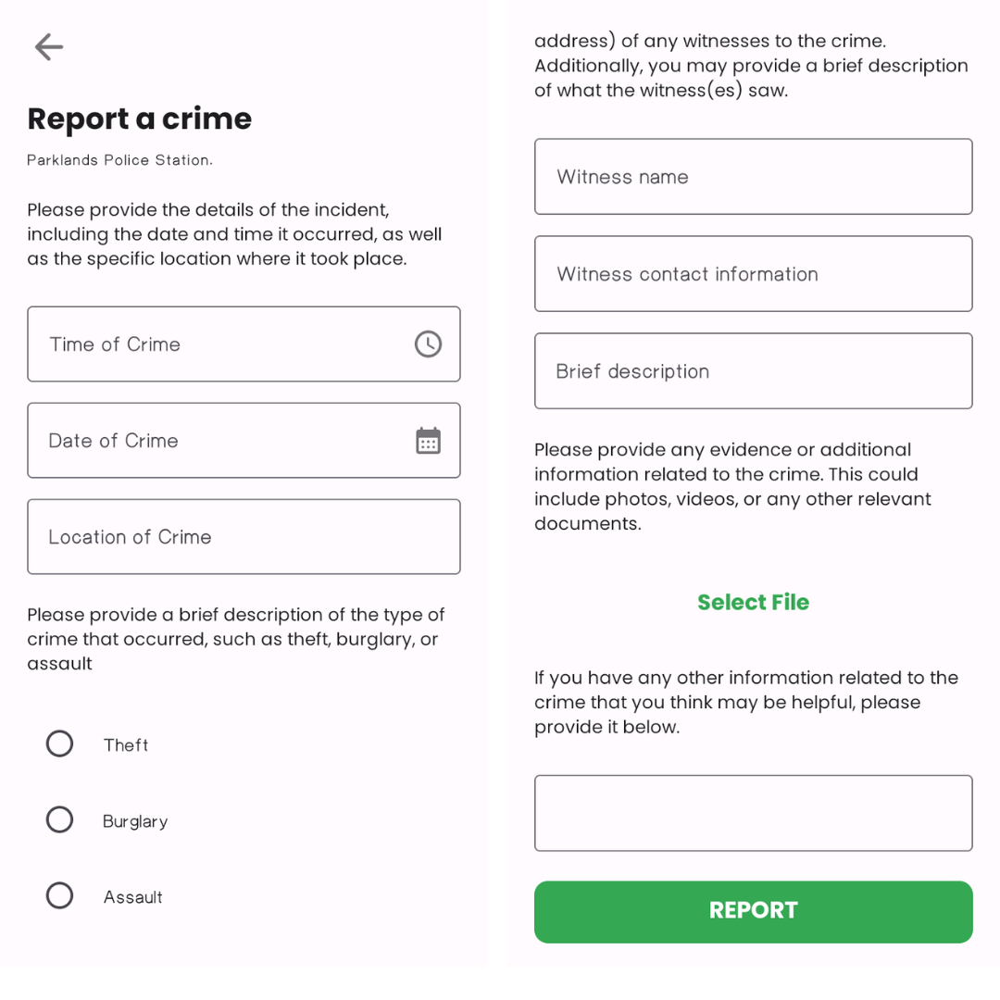

# SAFECITY APP
**🚧 Project Status: Under Active Development 🚧**

SafeCity App is a mobile application that allows users to report crimes and other incidents in their area. The app is made using Kotlin and Firebase.The app also allows users to view crime hotspots in their area and also view the crime statistics of their area.

## 📱 Screenshots
The app retrieves the user location and displays it on a map. Google Maps API is used to display the map. The app also retrieves the device location co-ordinates and displays it on the map. The app also allows users to report crimes and other incidents in their area. The app also allows users to view crime hotspots in their area and also view the crime statistics of their area.

## 🛠 Tech/framework used
**Built with**
- [Kotlin](https://kotlinlang.org/)
- [JetPack Compose](https://developer.android.com/jetpack/compose)
- [Firebase](https://firebase.google.com/)
- [Google Maps API](https://developers.google.com/maps/documentation)

## IMPORTANT NOTE
This app is done as a part of a school project and is only meant as a proof of concept. A real world application would require a lot more features and security. This app is not meant to be used in production. 

## 🛠 Installation & Set Up
MAPS API KEY is required to run the app. The API key can be obtained from the Google Cloud Platform. The API key should be added to the `AndroidManifest.xml` file.

## 📝 License
This project is licensed under Apache License 2.0 - see the LICENSE file for details.